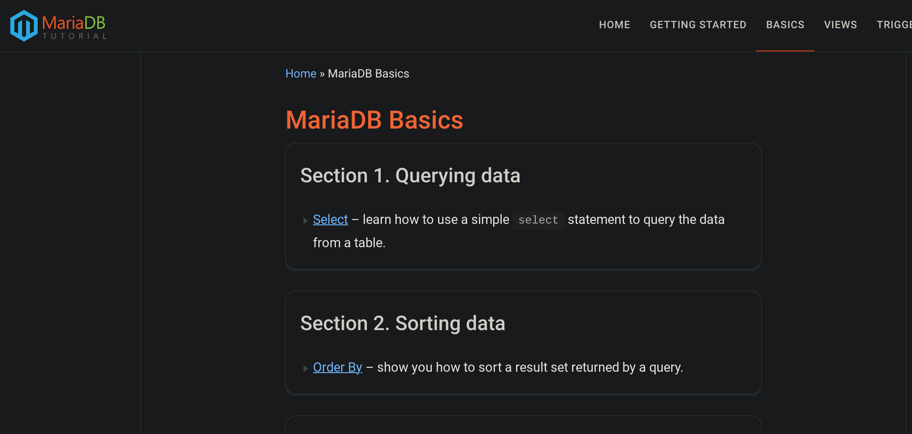

+++
date = '2024-12-17T12:34:26-05:00'
draft = false
title = 'Programing tutorials'
author = "DonGato"
tags = ["sql", "programming", "tutorial", "Vim"]
featured_image = "code.webp"
+++

These are some tutorials I have run through lately to keep my skill sharp / learn some new stuff during my Convalescence.

## mariadbtutotial.com

[mariadbtutotial.com/mariadb basics](https://www.mariadbtutorial.com/mariadb-basics/mariadb-select/)

## LazyVim

> LazyVim is a Neovim setup powered by 💤 lazy.nvim to make it easy to customize and extend your config. 
> Rather than having to choose between starting from scratch or using a pre-made distro, LazyVim offers the best of both worlds - the flexibility to tweak your config as needed, along with the convenience of a pre-configured setup.
[LazyVim](https://github.com/LazyVim/LazyVim)