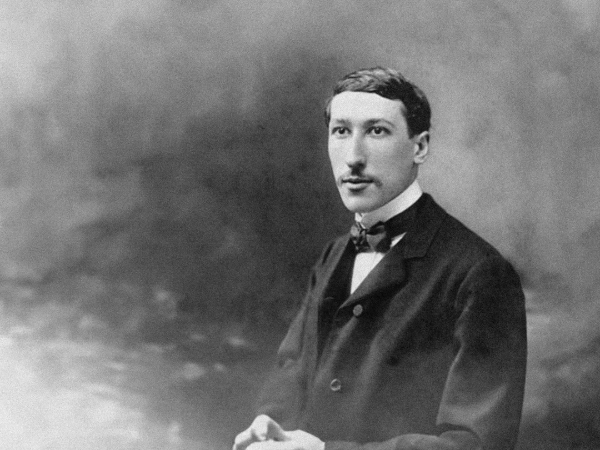

This is a place for orphaned quotes. If I collect multiple quotes from a single person, they will be moved to their own post.  

> “I believe that the extraordinary should certainly be pursued. But extraordinary claims require extraordinary evidence.”  
> *— Carl Sagan, Broca’s Brain: Reflections on the Romance of Science*

> “Religion is regarded by the common people as true, by the wise as false, and by the rulers as useful.”  
> *— Lucius Annaeus Seneca*  

> “Modern man, instead of attempting to raise himself to truth, seeks to drag truth down to his own level.”
> *― René Guénon, The Crisis of the Modern World*

