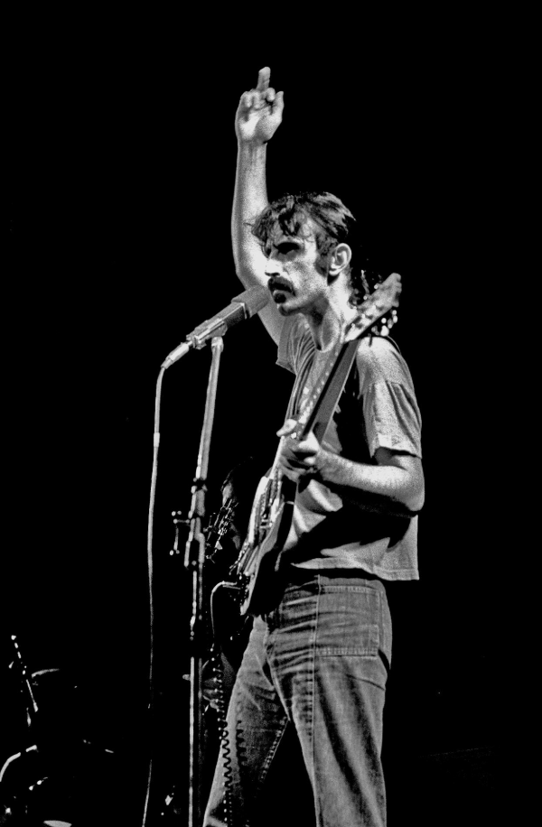

This is a place for orphaned quotes. If I collect multiple quotes from a single person, they will be moved to their own post.  

> “I believe that the extraordinary should certainly be pursued. But extraordinary claims require extraordinary evidence.”  
> *— Carl Sagan, Broca’s Brain: Reflections on the Romance of Science*

> “Religion is regarded by the common people as true, by the wise as false, and by the rulers as useful.”  
> *— Lucius Annaeus Seneca*  

> “Modern man, instead of attempting to raise himself to truth, seeks to drag truth down to his own level.”
> *― René Guénon, The Crisis of the Modern World*

> “If you end up with a boring miserable life because you listened to your mom, your dad, your teacher, your priest, or some guy on television telling you how to do your shit, then you deserve it.”
> *― Frank Zappa*
